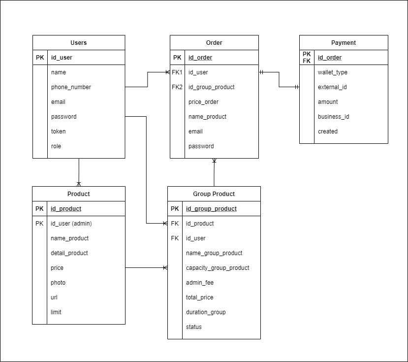

<!-- PROJECT LOGO -->
 

<!--  mengarah ke repo  -->
  

  <h3 align="center">Barengin</h3>

  

    Final Project Capstone Program Immersive Alterra Academy
     
    <a href="https://app.swaggerhub.com/apis-docs/supriadi15001/final-project_alta_barengin/1.0"><strong>Explore the docs Open API »</strong></a>
     
  

<!-- ABOUT THE PROJECT -->
## About The Project

<!-- [![Product Name Screen Shot][product-screenshot]](https://example.com) -->

Barengin merupakan platform untuk mempertemukan calon customer yang ingin berlangganan produk digital tertentu dengan pengguna lain untuk mendapatkan keuntungan layanan premium secara patungan.

Berikut fitur yang terdapat dalam barengin :
| Feature | Admin | Customer | Guest
|:----------| :----------:| :----------:|:----------:|
| Signup | No | No | Yes
| Login | Yes | Yes | No
|---|---|---|---|
| Get all users | Yes | No | No
| Get user by id | Yes | Yes | No
| Update user by id | Yes | Yes | No
| Delete user by id | Yes | Yes | No
|---|---|---|---|
| Create product | Yes | No | No
| Get all products | Yes | Yes | Yes
| Get product by id | Yes | Yes | Yes
| Update product by id | Yes | No | No
| Delete product by id | Yes | No | No
|---|---|---|---|
| Create group product | No | Yes | No
| Get all group product | Yes | Yes | Yes
| Get group product by id group product | Yes | Yes | Yes
| Get group product by id product | Yes | Yes | Yes
| Get group product by status | Yes | Yes | Yes
|---|---|---|---|
| Create order | No | Yes | No
| Get all orders by id group | Yes | No | No
| Get all order by id user | Yes | Yes | No
| Get order by id order | Yes | Yes | No
| Update order by id order | Yes | No | No
|---|---|---|---|

(<a href="#top">back to top</a>)

### Built With

<!-- * [Golang](https://golang.org/)
* [Echo Framework](https://echo.labstack.com/)
* [MySQL](https://www.mysql.com/)
* [Gorm](https://gorm.io/)
* [JWT](https://echo.labstack.com/cookbook/jwt)
* [Assert](https://pkg.go.dev/github.com/stretchr/testify/assert)
* [VS Code](https://code.visualstudio.com/) -->
&nbsp;
&nbsp;
&nbsp;

(<a href="#top">back to top</a>)

<!-- ERD -->
## ERD

(<a href="#top">back to top</a>)

<!-- How to Use -->
## How to Use

<!-- CONTACT -->
## Contact

Project Link : [https://github.com/project-capstone](https://github.com/project-capstone) 
Open API Documentation : [https://app.swaggerhub.com/apis-docs/supriadi15001/final-project_alta_barengin/1.0#/](https://github.com/project-capstone)&nbsp;
<!-- :heart: -->
<!-- CONTRIBUTOR -->
Contributor :
 

 
Mentor :
 
<!-- https://www.linkedin.com/in/iffakhry/ -->

(<a href="#top">back to top</a>)

<h3>

:copyright: 2021 | Built with :heart: from us

</h3>